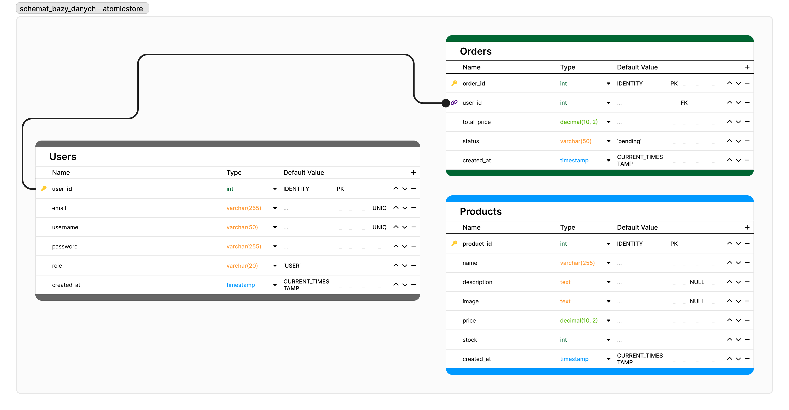

# Dokumentacja Atomic Store 
#### _API zintegrowane z bazą danych_

## Wprowadzenie
Celem projektu jest udostępnienie end-pointów umożliwiających łatwą i efektywną interakcję z bazą danych, eliminując potrzebę pisania skomplikowanych zapytań SQL. Atomic Store API zapewnia wydajną warstwę komunikacji, która upraszcza procesy tworzenia, odczytu, aktualizacji i usuwania danych (CRUD) w nowoczesnych aplikacjach. Ścieżki API zostały zabezpieczone, poprzez autoryzację nazwą użytkownika i hasłem oraz istnieje obsługa polskich znaków diakrytycznych. Projekt używa oprogramowania Docker do konteneryzacji, aby ułatwić przebudowę, wdrożenie i uruchamianie aplikacji zatem istnieje przykładowy schemat bazy danych oraz przykładowe dane w projekcie (kolejno /main/resources/schema.sql i /main/resources/data.sql).

## Konstrukcja i struktura aplikacji
W projekcie użyto następujących składników, programów i języków programowania:
- Języki programowania i zapytań:
-- Java (wersja 17)
-- SQL (dialekt PostgreSQL)
- Zależności:
-- Spring Boot (3.4.1) (framework do tworzenia aplikacji np. webowych opartych na Spring Framework)
-- Lombok (biblioteka która ułatwia definiowanie klas)
-- Springdoc (biblioteka do generowania dokumentacji API)
-- Postgres (biblioteka do obsługi bazy danych)
-- testcontainers (biblioteka służąca do tworzenia baz danych w Dockerze)
- Dodatkowe potrzebne oprogramowanie
-- Docker
-- zajacp/postgresql-pl:15.3 (obraz polskiej wersji językowej postgresu)
-- Maven (proces konwertujący kod źródłowy do postaci wykonywalnej)

Projekt składa się z podanej poniżej struktury folderów i plików (wykazano kluczowe ścieżki) :
```
AtomicStoreAPI
└── src
    └── main
        ├── java
        │   └── pl
        │       └── projekt
        │           └── store
        │               ├── config
        │               │   ├── OpenAPIConfig.java
        │               │   └── SecurityConfig.java
        │               ├── controller
        │               │   ├── PrivateController.java
        │               │   ├── PublicController.java
        │               │   └── PublicCursorController.java
        │               ├── model
        │               │   ├── Orders.java
        │               │   ├── Products.java
        │               │   └── Users.java
        │               ├── repository
        │               │   ├── OrdersRepository.java
        │               │   ├── ProductsRepository.java
        │               │   └── UsersRepository.java
        │               ├── service
        │               │   ├── OrdersService.java
        │               │   ├── ProductsService.java
        │               │   └── UsersService.java
        │               └── AtomicStoreApplication.java
        └── resources
                ├── public
                │   └── index.html
                ├── application.properties
                ├── data.sql
                └── schema.sql
```

### Schemat bazy danych



## Budowa aplikacji
W tej części dokumentacji znajduje się opis działania poszczególnych części kodów.

## src/main/java/pl/projekt

### /store/config/OpenApiConfig.java

Plik konfiguracyjny OpenApi dla Spring, umożliwia udokumentowanie i eksplorację API w formacie OpenAPI/Swagger. Tworzony jest obiekt **OpenAPI** z informacjami o API, takimi jak tytuł, wersja, opis, dane kontaktowe oraz serwer aplikacji. Definiuje dwie grupy punktów końcowych (GroupedOpenApi): zastrzeżone metody, wymagające logowania, obejmujące ścieżki **/api/private/users/\*\*** i **/api/private/admin/\*\***, oraz publiczne metody, dostępne bez logowania, obejmujące ścieżki **/api/public/\*\*** i **/api/public/cursor/\*\***. Każda grupa pomaga w organizacji punktów końcowych API. Dzięki temu aplikacja udostępnia przejrzystą dokumentację dla różnych typów użytkowników.

### /store/config/SecurityConfig.java

Plik konfiguracyjny zabezpieczeń w aplikacji Spring Boot używający Spring Security. Główna klasa SecurityConfig oznaczona adnotacją @Configuration definiuje ustawienia związane z bezpieczeństwem aplikacji. Metoda filterChain ustawia reguły dostępu do różnych zasobów, w tym publiczny dostęp do dokumentacji API (Swagger), ograniczenia dla zasobów prywatnych na podstawie ról użytkowników (ADMIN lub USER), oraz wyłączenie CSRF i konfigurację CORS. Dodatkowo, zdefiniowano bean PasswordEncoder oparty na BCryptPasswordEncoder, który odpowiada za szyfrowanie haseł. Bean UserDetailsService ładuje szczegóły użytkownika z bazy danych, używając UsersRepository, oraz przekształca je w obiekt zgodny z wymaganiami Spring Security. Obsługiwane są różne role użytkowników, a dostęp do zasobów prywatnych jest ograniczony zgodnie z zasadami zdefiniowanymi w metodzie filterChain.

W zakomentowanej części kodu znajdują się alternatywne implementacje dla testowego logowania i użytkowników zapisanych w pamięci (na sztywno).

### /store/controller/PrivateAdminController.java
Plik zawiera zestaw endpointów dla operacji administracyjnych dotyczących produktów, zamówień i użytkowników. Wszystkie endpointy wymagają odpowiednich uprawnień i logowania. Działania są obsługiwane przez serwisy (UsersService, ProductsService, OrdersService), które implementują logikę biznesową. Opis poszczególnych endpointów znajduje się w dziale **Metody HTTP**.

### /store/controller/PrivateUserController.java
Plik PrivateUserController to kontroler REST API w aplikacji Spring, dedykowany do obsługi użytkowników i operacji dostępnych dla nich po zalogowaniu. W tym przypadku, kontroler zawiera jeden endpoint, który zwraca listę wszystkich produktów dostępnych w sklepie.

### /store/controller/PublicController.java
Plik PublicController to kontroler REST API obsługujący publiczne endpointy aplikacji. W tym przypadku zawiera jedną metodę, która umożliwia logowanie użytkownika. Endpoint nie wymaga wcześniejszego zalogowania, ale weryfikuje dane logowania użytkownika.

### /store/controller/PublicCursorController.java
Plik PublicCursorController to kontroler REST API umożliwiający pobieranie danych z bazy przy użyciu bezpośredniego zapytania SQL i kursora za pośrednictwem JdbcTemplate. Tego rodzaju implementacja pozwala na bezpośrednie przetwarzanie wyników zapytań w sposób iteracyjny.

### /store/model/Orders.java
##### Klasa Orders
Jest to model encji reprezentujący zamówienia w systemie sklepowym. Klasa jest mapowana na tabelę Orders w bazie danych za pomocą adnotacji JPA (Jakarta Persistence API).
##### Cel i zastosowanie
Encja Orders jest używana do przechowywania i zarządzania informacjami o zamówieniach użytkowników. Każdy obiekt tej klasy odpowiada pojedynczemu zamówieniu w bazie danych.
##### Główne elementy klasy
###### Adnotacje JPA:
**@Entity**: Określa, że klasa jest encją mapowaną na tabelę w bazie danych.
**@Table(name = "Orders"**): Ustawia nazwę tabeli w bazie danych.
###### Pola i ich przeznaczenie:
**orderId**:
- Unikalny identyfikator zamówienia.
- Automatycznie generowany (@GeneratedValue)

**userId**:
- ID użytkownika, który złożył zamówienie.

**totalPrice**:
- Całkowity koszt zamówienia.
- Pole typu BigDecimal, co zapewnia precyzyjne przechowywanie wartości pieniężnych.

**status**:
- Status zamówienia, określający jego bieżący stan.
- Wartości są przechowywane jako String w bazie danych (mapowanie @Enumerated(EnumType.STRING)).
- Domyślna wartość to PENDING.

**createdAt**:
- Data i czas utworzenia zamówienia.
- Domyślnie ustawiana na bieżący czas (LocalDateTime.now()).

**Typ wyliczeniowy OrderState**:
- Określa możliwe stany zamówienia, np. READY, PENDING, DELIVERED.

**Gettery i Settery**:
- Umożliwiają odczyt i modyfikację pól klasy.

### /store/model/Products.java
##### Klasa Products
Klasa Products jest modelem encji reprezentującym produkty dostępne w systemie sklepowym. Klasa jest mapowana na tabelę Products w bazie danych za pomocą adnotacji JPA (Jakarta Persistence API).

##### Cel i zastosowanie
Encja Products jest używana do przechowywania i zarządzania informacjami o produktach w sklepie. Każdy obiekt tej klasy odpowiada jednemu produktowi w bazie danych.

##### Główne elementy klasy
###### Adnotacje JPA:

**@Entity**: Oznacza, że klasa jest encją mapowaną na tabelę w bazie danych.
**@Table(name = "Products")**: Określa nazwę tabeli w bazie danych jako Products.
###### Pola i ich przeznaczenie:

**productId**:
- Unikalny identyfikator produktu.
- Automatycznie generowany przy użyciu strategii GenerationType.IDENTITY.

**name**:
- Nazwa produktu.
- Pole jest wymagane (nullable = false).

**description**:
- Opcjonalny opis produktu.

**image**:
- URL do zdjęcia produktu (opcjonalne pole).

**price**:
- Cena produktu w formacie BigDecimal, zapewniająca precyzję przechowywania wartości pieniężnych.
- Pole jest wymagane (nullable = false).

**stock**:
- Liczba sztuk produktu dostępnych w magazynie.
- Pole jest wymagane (nullable = false).

**createdAt**:
- Data i czas utworzenia produktu.
- Domyślnie ustawiana na bieżący czas (LocalDateTime.now()).

**Gettery i Settery**:
- Umożliwiają odczyt i modyfikację wartości pól klasy.

### /store/model/Users.java
##### Klasa Users
Klasa Users jest modelem encji reprezentującym użytkowników systemu sklepowego. Klasa jest mapowana na tabelę Users w bazie danych za pomocą adnotacji JPA (Jakarta Persistence API).

##### Cel i zastosowanie
Encja Users jest używana do przechowywania i zarządzania informacjami o użytkownikach systemu sklepowego. Każdy obiekt tej klasy odpowiada jednemu użytkownikowi w bazie danych.

##### Główne elementy klasy
###### Adnotacje JPA:
**@Entity**: Oznacza, że klasa jest encją mapowaną na tabelę w bazie danych.
**@Table(name = "Users")**: Określa nazwę tabeli w bazie danych jako Users.
###### Pola i ich przeznaczenie:

**userId**:
- Unikalny identyfikator użytkownika.
- Automatycznie generowany przy użyciu strategii GenerationType.IDENTITY.

**username**:
- Nazwa użytkownika:
- Musi być unikalna i jest wymagana (nullable = false).

**email**:
- Adres e-mail użytkownika.
- Musi być unikalny i jest wymagany (nullable = false).

**password**:
- Hasło użytkownika.
- Pole wymagane (nullable = false).

**role**:
- Rola użytkownika w systemie.
- Może przyjmować wartości USER lub ADMIN zgodnie z typem wyliczeniowym UserRole.
- Przechowywana w bazie danych jako tekst (EnumType.STRING).
- Pole wymagane (nullable = false).

**createdAt**:
- Data i czas utworzenia konta użytkownika.
- Domyślnie ustawiana na bieżący czas przy użyciu LocalDateTime.now().

**Gettery i Settery**:
- Umożliwiają odczyt i modyfikację wartości pól klasy.

### /store/repository/OrdersRepository.java
Kod definiuje interfejs OrdersRepository, który jest częścią warstwy dostępu do danych (repository) w aplikacji korzystającej z frameworka Spring Data JPA. Oto jego główne cechy:

- Rozszerza JpaRepository<Orders, Long>: Dzięki temu interfejs dziedziczy standardowe metody CRUD (Create, Read, Update, Delete) dla encji Orders. Encja Orders ma klucz główny typu Long.

- Dodatkowe metody wyszukiwania:
-- **findByUserId(Long userId**): Znajduje zamówienie na podstawie identyfikatora użytkownika (userId). Zwraca obiekt Optional<Orders>, co pozwala na obsługę sytuacji, gdy zamówienie nie istnieje.
-- **findByOrderId(Long orderId)**: Znajduje zamówienie na podstawie identyfikatora zamówienia (orderId). Również zwraca obiekt Optional<Orders>.

Interfejs ten służy do zarządzania danymi związanymi z zamówieniami w bazie danych i umożliwia łatwe rozszerzanie funkcjonalności dzięki Spring Data JPA.

### /store/repository/ProductsRepository.java

Powyższy kod definiuje interfejs ProductsRepository, który jest częścią warstwy dostępu do danych w aplikacji korzystającej z frameworka Spring Data JPA. Oto jego główne cechy:

- Rozszerza JpaRepository<Products, Long>: Dzięki temu interfejs dziedziczy standardowe metody CRUD (Create, Read, Update, Delete) dla encji Products. Encja Products ma klucz główny typu Long.

- Dodatkowe metody wyszukiwania:
-- **findByName(String name)**: Znajduje produkt na podstawie jego nazwy (name). Zwraca obiekt Optional<Products>, co pozwala na obsługę sytuacji, gdy produkt o podanej nazwie nie istnieje.
-- **findById(Long id) (nadpisane)**: Znajduje produkt na podstawie jego identyfikatora (id). Metoda ta nadpisuje standardową implementację z JpaRepository, co jest użyteczne w celu dostosowania jej działania.

Interfejs ten służy do zarządzania danymi produktów w bazie danych i umożliwia łatwe rozszerzanie funkcjonalności dzięki Spring Data JPA.

### /store/repository/UsersRepository.java

Powyższy kod definiuje interfejs UsersRepository, który jest częścią warstwy dostępu do danych w aplikacji korzystającej z frameworka Spring Data JPA. Oto jego główne cechy:

- Rozszerza JpaRepository<Users, Long>: Dzięki temu interfejs dziedziczy standardowe metody CRUD (Create, Read, Update, Delete) dla encji Users. Encja Users ma klucz główny typu Long.

- Dodatkowa metoda wyszukiwania:
-- **findByUsername(String username)**: Znajduje użytkownika na podstawie nazwy użytkownika (username). Zwraca obiekt Optional<Users>, co pozwala na obsługę sytuacji, gdy użytkownik o podanej nazwie nie istnieje.

Interfejs ten służy do zarządzania danymi użytkowników w bazie danych i umożliwia łatwe rozszerzanie funkcjonalności dzięki Spring Data JPA. Jest szczególnie przydatny w implementacji funkcjonalności takich jak logowanie czy autoryzacja.

### /store/service/OrdersService.java
Powyższy kod jest serwisem w aplikacji Spring, który zarządza zamówieniami w sklepie. Klasa ta, oznaczona adnotacją @Service, służy jako warstwa logiki biznesowej, łącząc się z repozytoriami w celu wykonywania operacji na danych dotyczących zamówień oraz produktów. Oto szczegóły poszczególnych metod i komponentów:

#### Klasa: OrdersService
- **Konstruktor**
Przyjmuje dwa repozytoria jako zależności:
OrdersRepository — do obsługi danych zamówień.
ProductsRepository — do obsługi danych produktów.
Zależności są wstrzykiwane poprzez konstruktor (typowe w Springu).

- **Pola prywatne**
ordersRepository — do pracy z zamówieniami.
productsRepository — do pracy z produktami.

#### Metody
- **findAllOrders()**
Zwraca listę wszystkich zamówień z bazy danych.
Używa metody findAll() z repozytorium OrdersRepository.

- **createOrder(Long userid, BigDecimal price, Orders.OrderState status)**
Tworzy nowe zamówienie.
Ustawia:
userId (ID użytkownika tworzącego zamówienie),
totalPrice (łączną cenę zamówienia),
status (status zamówienia, np. "W trakcie realizacji", "Zakończone"),
createdAt (czas utworzenia zamówienia — obecny moment).
Zapisuje zamówienie do bazy danych za pomocą metody save() z repozytorium OrdersRepository.

- **calculateOrderPrice(List<Long> productIds)**
Oblicza łączną cenę zamówienia na podstawie ID produktów:
Pobiera produkty z bazy danych (metoda findAllById() repozytorium ProductsRepository).
Sumuje ceny wszystkich produktów (używając strumieni Java i reduce()).

- **areProductsAvailable(List<Long> productIds)**
Sprawdza dostępność produktów (czy ich stan magazynowy jest większy od zera):
Iteruje po podanych ID produktów.
Pobiera każdy produkt z bazy danych (metoda findById() z ProductsRepository).
Rzuca wyjątek, jeśli produkt o danym ID nie istnieje.
Zwraca false, jeśli jakikolwiek produkt ma niedostępny stan (stock < 0).
Zwraca true, jeśli wszystkie produkty są dostępne.

- **getOrderById(Long id)**
Pobiera zamówienie na podstawie jego ID.
Korzysta z metody findById() z repozytorium OrdersRepository.
Zwraca obiekt Optional<Orders>, który może zawierać dane zamówienia lub być pusty, jeśli zamówienie nie istnieje.

#### Funkcjonalność serwisu:
Obsługuje proces tworzenia zamówienia.
Umożliwia obliczenie łącznej ceny zamówienia na podstawie produktów.
Sprawdza dostępność produktów (np. pod kątem stanu magazynowego).
Pozwala na pobranie istniejących zamówień.
#### Zastosowanie:
Ten serwis może być wykorzystywany przez kontrolery w aplikacji Spring do obsługi żądań dotyczących zamówień, takich jak:
- Tworzenie nowego zamówienia.
- Pobieranie szczegółów zamówienia.
- Weryfikacja dostępności produktów.

### /store/service/ProductsService.java
Powyższy kod to serwis w aplikacji Spring, który zarządza produktami w systemie (np. sklepie internetowym lub blogu z możliwością sprzedaży produktów). Klasa oznaczona jest adnotacją **@Service**, co wskazuje, że jest odpowiedzialna za logikę biznesową związaną z produktami. Współpracuje z repozytorium ProductsRepository, które obsługuje operacje na bazie danych.

- **Konstruktor**
Przyjmuje zależność:
ProductsRepository — repozytorium do zarządzania danymi produktów.
Zależność jest wstrzykiwana za pomocą konstruktora, co jest zgodne z podejściem Dependency Injection w Springu.

- **Pola prywatne**
productsRepository — referencja do repozytorium obsługującego produkty.

#### Metody
- **findAll()**
Zwraca listę wszystkich produktów z bazy danych.
Produkty są posortowane rosnąco po productId za pomocą klasy Sort z Spring Data.
Użycie sortowania jest uzasadnione, ponieważ operacje takie jak PUT mogą zmieniać kolejność produktów w bazie.

- **createProduct(String name, String description, String image, BigDecimal price, Integer stock)**
Tworzy nowy produkt w bazie danych.
Parametry metody:
name — nazwa produktu.
description — opis produktu.
image — URL lub ścieżka do zdjęcia produktu.
price — cena produktu.
stock — stan magazynowy produktu.
Ustawia dodatkowo czas utworzenia (createdAt) na bieżący moment.
Zapisuje produkt w bazie za pomocą save().

- **updateProduct(Long id, String name, String description, String image, BigDecimal price, Integer stock)**
Aktualizuje istniejący produkt na podstawie jego ID.
Pobiera produkt z bazy danych (metoda findById() repozytorium ProductsRepository).
Rzuca wyjątek IllegalArgumentException, jeśli produkt o podanym ID nie istnieje.
Aktualizuje właściwości produktu, jeśli podane parametry nie są null (np. nazwa, opis, cena, stan magazynowy).
Ustawia czas utworzenia (createdAt) na bieżący moment (można to poprawić, ustawiając raczej czas ostatniej modyfikacji).
Zapisuje zmiany w bazie danych za pomocą metody save().

- **deleteProduct(Long id)**
Usuwa produkt na podstawie jego ID.
Sprawdza, czy produkt istnieje w bazie danych (metoda existsById() repozytorium).
Jeśli produkt nie istnieje, rzuca wyjątek IllegalArgumentException.
Usuwa produkt za pomocą deleteById().

#### Funkcjonalność serwisu:
- Pobieranie produktów:
Zwraca listę wszystkich produktów posortowaną po productId.
- Tworzenie produktu:
Umożliwia dodanie nowego produktu z wymaganymi danymi, takimi jak nazwa, opis, cena, itd.
- Aktualizacja produktu:
Pozwala na modyfikację istniejącego produktu (częściową lub pełną).
- Usuwanie produktu:
Obsługuje usuwanie produktów z bazy danych.

#### Zastosowanie:
Ten serwis może być wykorzystywany przez kontrolery aplikacji Spring do:
- Wyświetlania listy produktów użytkownikom.
- Dodawania nowych produktów do oferty.
- Aktualizacji danych istniejących produktów.
- Usuwania produktów, które są już nieaktualne lub niedostępne.

### /store/service/UsersService.java
Powyższy kod definiuje serwis Spring o nazwie UsersService, który zarządza użytkownikami w systemie. Klasa oznaczona adnotacją @Service dostarcza logikę biznesową dotyczącą użytkowników, w tym ich tworzenie, aktualizację, usuwanie oraz weryfikację haseł. Współpracuje z repozytorium UsersRepository oraz komponentem PasswordEncoder do szyfrowania i weryfikacji haseł.

** Konstruktor **
Przyjmuje dwie zależności:
- **UsersRepository** — repozytorium do zarządzania danymi użytkowników.
- **PasswordEncoder** — komponent do szyfrowania haseł (np. BCryptPasswordEncoder).
Obie zależności są wstrzykiwane przez konstruktor (zgodnie z zasadami Dependency Injection w Springu).

**Pola prywatne**
- usersRepository — referencja do repozytorium użytkowników.
- passwordEncoder — mechanizm szyfrowania haseł.

#### Metody
- findUserById(Long userId)
Wyszukuje użytkownika na podstawie jego ID.
Zwraca obiekt Optional<Users> — może zawierać znalezionego użytkownika lub być pusty, jeśli użytkownik nie istnieje.

- **findAll()**
Zwraca listę wszystkich użytkowników z bazy danych za pomocą metody findAll() repozytorium UsersRepository.

- **findUserByUsername(String username)**
Wyszukuje użytkownika na podstawie jego nazwy użytkownika (username).
Zwraca obiekt Optional<Users>.

- **createUser(String username, String email, String rawPassword, Users.UserRole role)**
Tworzy nowego użytkownika w bazie danych.
Parametry metody:
username — nazwa użytkownika.
email — adres e-mail użytkownika.
rawPassword — surowe hasło użytkownika, które zostanie zaszyfrowane.
role — rola użytkownika (np. ADMIN, USER).
Hasło jest szyfrowane za pomocą passwordEncoder.encode().
Ustawia czas utworzenia (createdAt) na bieżący moment.
Zapisuje użytkownika w bazie danych za pomocą metody save().

- **updatePassword(Users user, String rawPassword)**
Aktualizuje hasło istniejącego użytkownika.
Szyfruje nowe hasło za pomocą passwordEncoder.encode().
Zapisuje zmiany w bazie danych.

- **deleteUserById(Long userId)**
Usuwa użytkownika na podstawie jego ID.
Wywołuje metodę deleteById() z repozytorium UsersRepository.

- **verifyPassword(Users user, String password)**
Weryfikuje poprawność podanego hasła względem zaszyfrowanego hasła użytkownika.
Wykorzystuje metodę passwordEncoder.matches(), która porównuje hasło wprowadzone przez użytkownika z hasłem przechowywanym w bazie danych.

#### Funkcjonalność serwisu
- **Wyszukiwanie użytkowników:**
Możliwość znalezienia użytkownika na podstawie ID lub nazwy użytkownika.
Pobieranie wszystkich użytkowników z bazy danych.
- **Tworzenie użytkowników:**
Dodawanie nowych użytkowników do systemu z zaszyfrowanym hasłem i określoną rolą.
- **Aktualizacja hasła użytkownika (z szyfrowaniem).**
- **Usuwanie użytkowników**:
Obsługa usuwania użytkownika z bazy danych na podstawie jego ID.
- **Weryfikacja haseł**:
Sprawdzanie poprawności wprowadzonego hasła użytkownika przy logowaniu lub innych operacjach.
Potencjalne ulepszenia
- **Walidacja danych**:
Dodanie walidacji dla nazwy użytkownika, e-maila oraz hasła (np. czy hasło ma odpowiednią długość, czy e-mail jest w poprawnym formacie).
- **Obsługa wyjątków**:
Zamiast zwracać Optional w metodach wyszukiwania, można rzucać niestandardowe wyjątki (np. UserNotFoundException) w przypadku baku użytkownika.
- **Obsługa czasu**:
Dodanie pola updatedAt do użytkowników, aby rejestrować czas ostatniej modyfikacji danych.
- **Rozdzielenie ról**:
Rozważenie wykorzystania Spring Security do zarządzania rolami użytkowników oraz ich uprawnieniami.

#### Zastosowanie
Serwis UsersService jest kluczowy dla aplikacji, która wymaga zarządzania użytkownikami. Może być wykorzystywany przez kontrolery Spring do:
- Obsługi logowania użytkowników (przez weryfikację hasła).
- Tworzenia nowych kont użytkowników.
- Zarządzania danymi użytkowników (np. aktualizacja hasła, usuwanie konta).
- Wyszukiwania użytkowników na potrzeby administracyjne lub operacyjne.

### /store/AtomicStoreApplication.java
#### Opis aplikacji
Jest to aplikacja o nazwie AtomicStoreApplication. Jest to aplikacja serwerowa/webowa, która wykorzystuje Spring Boot oraz bazę danych PostgreSQL, a także Testcontainers do obsługi kontenerów baz danych na potrzeby testowania i rozwoju.

#### Najważniejsze elementy kodu
##### Adnotacje Spring Boot
**@SpringBootApplication**: Jest to adnotacja główna aplikacji Spring Boot, która umożliwia automatyczne skanowanie komponentów, konfigurację oraz uruchamianie aplikacji.
##### Obsługa PostgreSQL za pomocą Testcontainers
**Testcontainers**: Biblioteka służąca do uruchamiania kontenerów Dockera w testach lub podczas rozwoju.
**postgresContainer()**:
Tworzy kontener PostgreSQL z obrazem Dockera o nazwie zajacp/postgresql-pl:15.3.
Ustawia nazwę bazy danych jako atomic_store.
Konfiguruje zmienne środowiskowe, takie jak POSTGRES_INITDB_ARGS, które definiują kodowanie i ustawienia lokalizacji (pl_PL.UTF-8).
Kontener jest uruchamiany automatycznie za pomocą metody **start()**.

**@ServiceConnection**: Informuje Spring Boot DevTools, że ten komponent jest powiązany z usługą (PostgreSQL w tym przypadku).
**@RestartScope**: Zapewnia, że obiekt będzie rekonfigurowany po ponownym uruchomieniu aplikacji w trybie developerskim.
##### Obsługa zamykania kontenera
**@PreDestroy**:
Metoda **stopContainer()** jest oznaczona tą adnotacją, co oznacza, że zostanie wykonana przed zniszczeniem obiektu lub zamknięciem aplikacji.
Zamyka kontener PostgreSQL, jeśli został wcześniej uruchomiony.
##### Kodowanie haseł
**BCryptPasswordEncoder**:
Używana do kodowania haseł w aplikacjach, szczególnie w kontekście bezpieczeństwa.
Kod zawiera zakomentowany przykład użycia, gdzie hasło "a" jest kodowane za pomocą BCrypt.
#### Funkcjonalność
**Kontener PostgreSQL**:
Umożliwia szybkie uruchamianie bazy danych PostgreSQL w środowisku Dockera.
Kontener jest skonfigurowany z polskimi ustawieniami lokalizacji - aplikacja jest przeznaczona do użytku w polskim środowisku.
**Obsługa cyklu życia aplikacji**:
Automatyczne uruchamianie i zamykanie kontenera PostgreSQL.

## API

Do uruchomienia aplikacji AtomicStoreAPI ptrzebne są wcześniej opisane programy (Java (17), Docker(zajacp/postgresql-pl:15.3)). Do uruchomienia programu używamy komendy `.\mvnw.cmd spring-boot:run` w głównym folderze projektu (w miejscu gdzie znajduje się plik mvnw.cmd dla Windowsa lub mvnw dla Linuxa). Domyślnym adresem jest `http://localhost:8080/swagger-ui/index.html`. W prawym górnym rogu znajdują się wcześniej wspomniane definicje (Select a definition). Aby uruchomić zastrzeżone metody hasłem i nazwą użytkownika, możemy użyć poświadczeń dla roli:
- USER: Nazwa użytkownika: **`user`**, Hasło: **`a`**
- ADMIN: Nazwa użytkownika: **`admin`**, Hasło: **`a`**